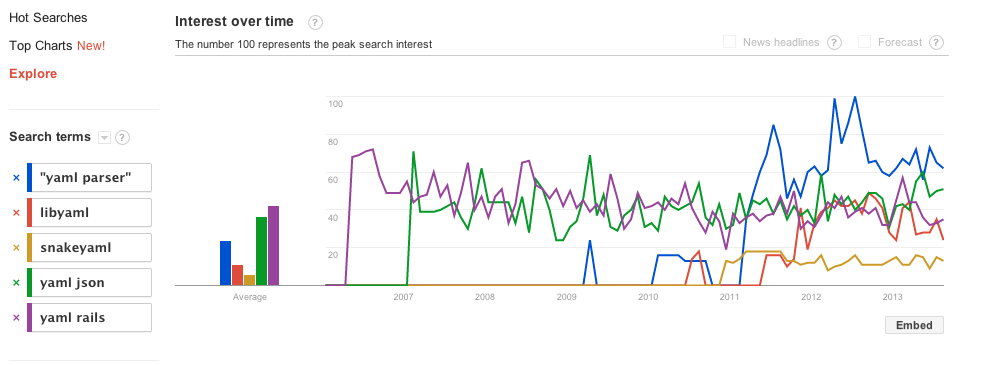

## [YAML Community Opinions](https://gist.github.com/bf4/6331778)

I'm preparing a talk on [YAML](http://railsisrael2013.events.co.il/presentations/868-yaml-what-is-it-good-for) and am interested in collecting thoughts and opinions about it and where it's going.

*Pull requests welcome!!!*

Here's an example:

[Mark Bates](https://github.com/markbates/configatron/issues/48):

> YAML is terrible and should be driven from the face of the Earth.

I'm also interested in the reason for this opinion. 

Mark prefers JSON as it is better supported across languages and doesn't have security issues.

What are your thoughts and opinions? Links ok, too.

(You can comment on the [gist](https://gist.github.com/bf4/6331778) or submit a PR.)

Here's a snapshot of google searches for your enjoyment:

